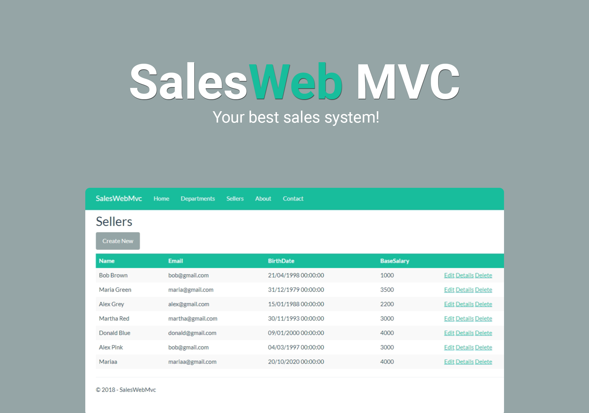

<h1 align="center">
  
</h1>
 

  <a href="#-projeto">Projeto</a>&nbsp;&nbsp;&nbsp;|&nbsp;&nbsp;&nbsp;
  <a href="#-tecnologias">Tecnologias</a>&nbsp;&nbsp;&nbsp;|&nbsp;&nbsp;&nbsp;
  <a href="#-features">Features</a>&nbsp;&nbsp;&nbsp;|&nbsp;&nbsp;&nbsp;
  <a href="#-layout">Layout</a>&nbsp;&nbsp;&nbsp;|&nbsp;&nbsp;&nbsp;
  <a href="#-executando-o-projeto">Executando o projeto</a>&nbsp;&nbsp;&nbsp;|&nbsp;&nbsp;&nbsp;
  <a href="#memo-licença">Licença</a>

 

  
  
  
  

  Diferente dos meus outros projetos, não conseguirei disponibilizar aqui o acesso web, pois a arquitetura deste não suporta Vercel, somente hospedagens pagas.

## ✨ Projeto

Sales Web MVC foi minha primeira aplicação do zero para web, desenvolvida em ASP.NET MVC com C#, se resume a uma aplicação de controle de vendas. Sendo possível cadastrar vendedores e departamentos.

## 🚀 Tecnologias

Esse projeto foi desenvolvido com as seguintes tecnologias/bibliotecas:

<table border="0">
 <tr>
<td> HTML5</td>
<td> CSS3</td>
<td> Javascript</td>
<td> C#</td>
<td> Linq</td>
<td> UML</td>
<td> Entity Framework</td>
<td> Asp.NET</td>
 </tr>
</table>

## 🌟 Features

-   [ ] 100% responsivo em resoluções até 4k.
-   [ ] Cadastro de vendedores e departamentos.
-   [ ] SPA resultando em alto desempenho no carregamento.
-   [ ] Páginas extras como "Sobre" e "Contato".

## 🎨 Layout

 Este projeto não foi desenvolvido a partir de um figma.

## 👨🏻‍💻 Executando o projeto

Para executar este projeto você irá precisar do [Visual Studio Community.](https://visualstudio.microsoft.com/pt-br/vs/community/)

## :memo: Licença

Esse projeto está sob a licença MIT. Veja o arquivo [LICENSE](./LICENSE.md) para mais detalhes.

---
